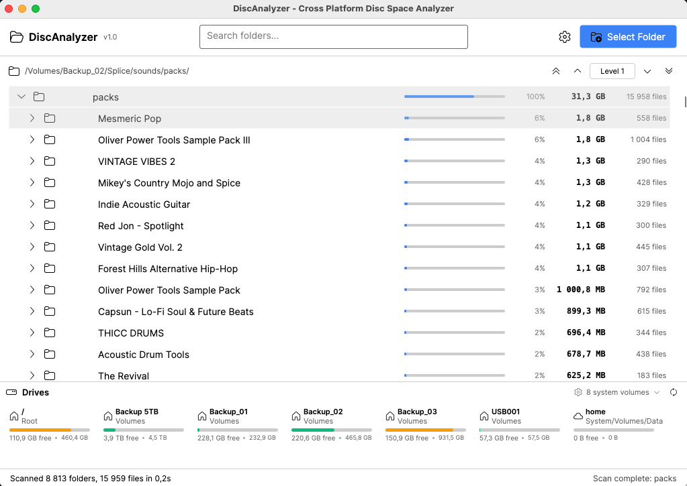
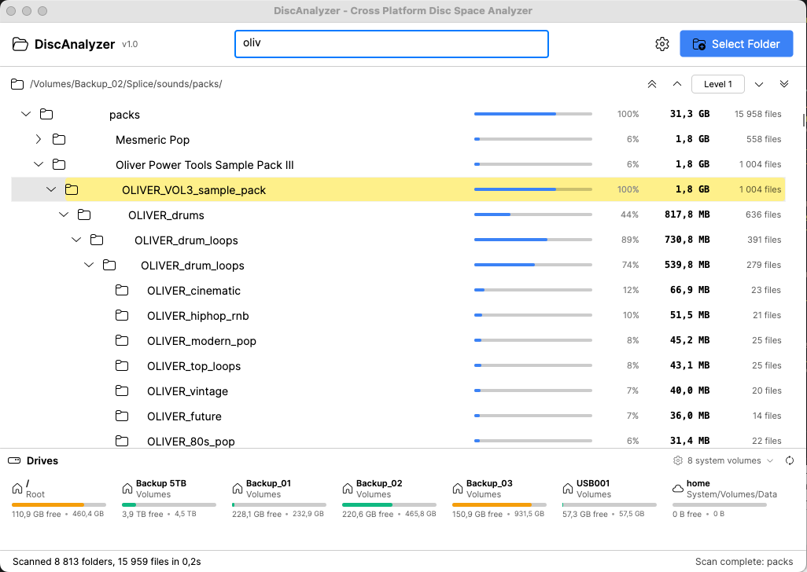
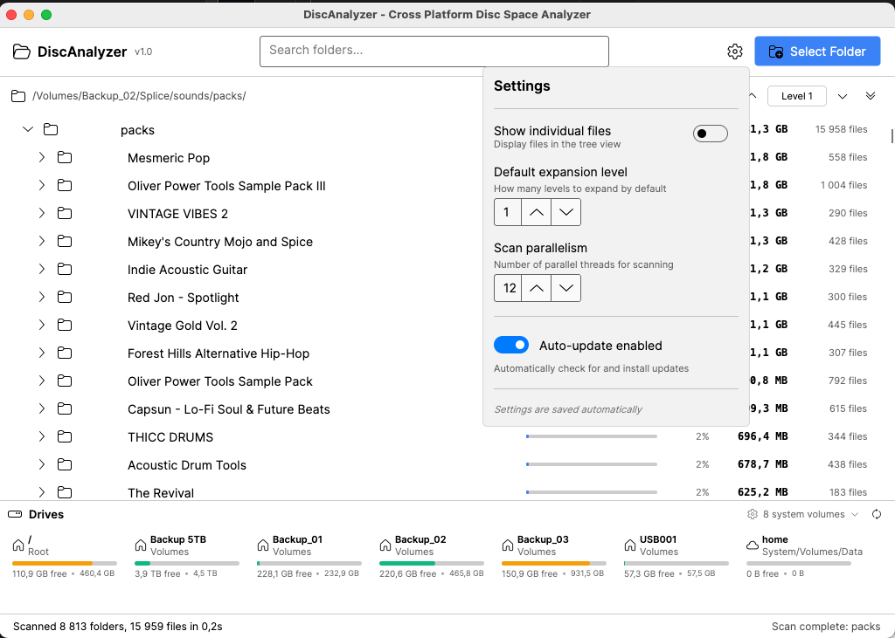

# DiscAnalyzer

I needed a cross-platform disc-space viewer so I built one in C# with Avalonia UI.   
Feel free to use.

## Download

Go to [Releases](https://github.com/JohnKesko/DiscAnalyzer/releases/latest) and pick the right file for your system:

| OS | Download this |
|--------------|---------------|
| **Windows** | `DiscAnalyzer-win-Setup.exe` |
| **macOS** | `DiscAnalyzer-osx-Setup.pkg` |




**Search**


**Auto Update**


**Run**

```bash
dotnet run
```

**Stack**

- .NET 10
- Avalonia UI
- FluentIcons

---

MIT
